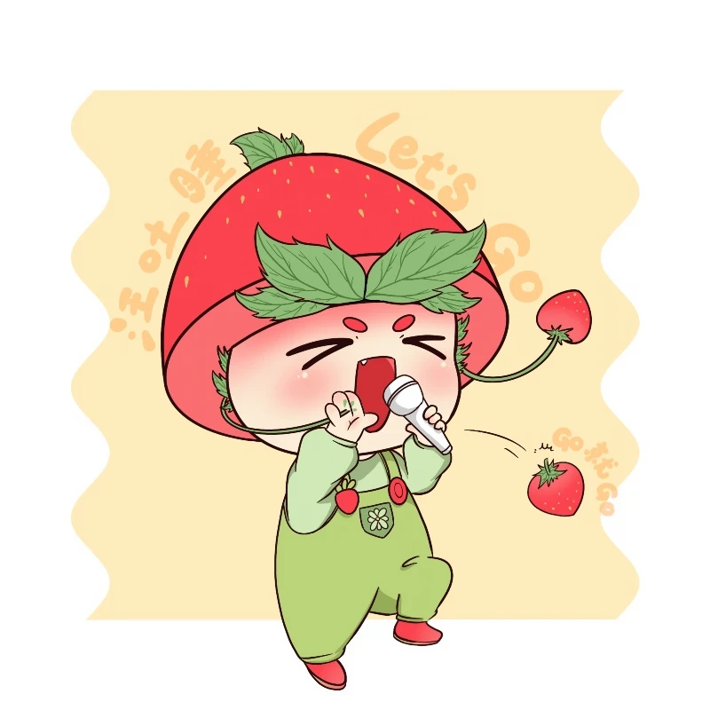
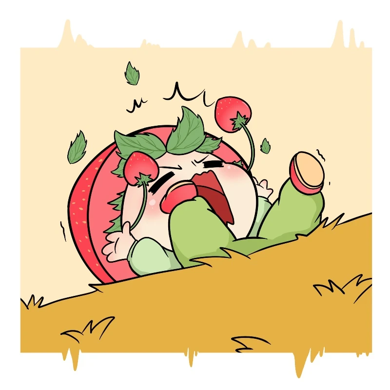
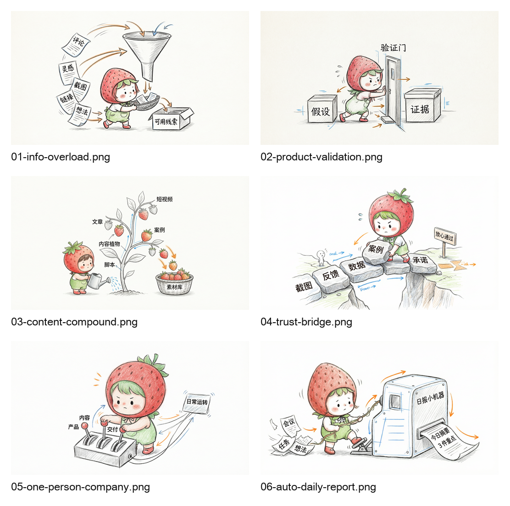
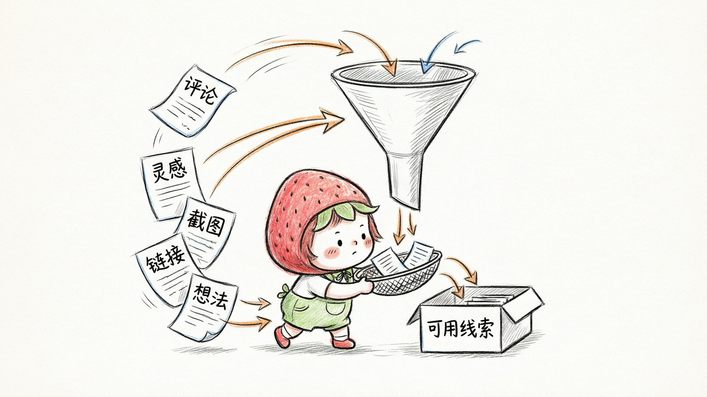
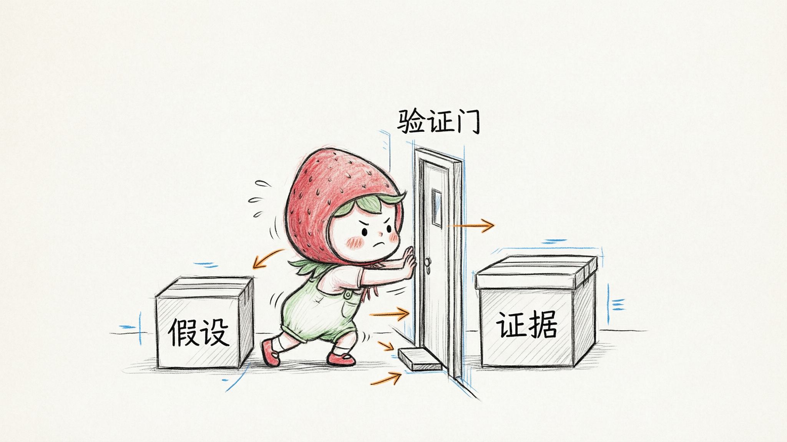
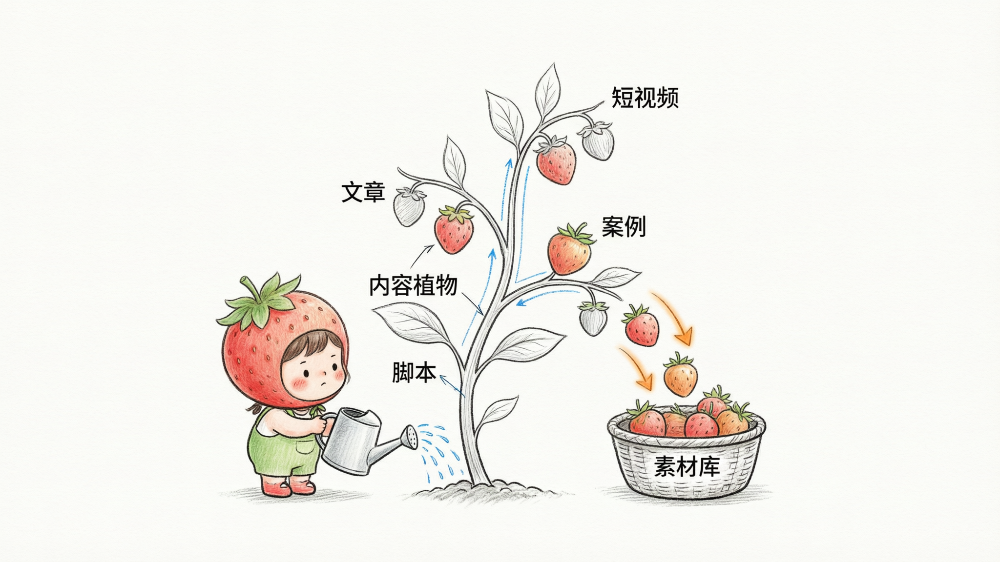
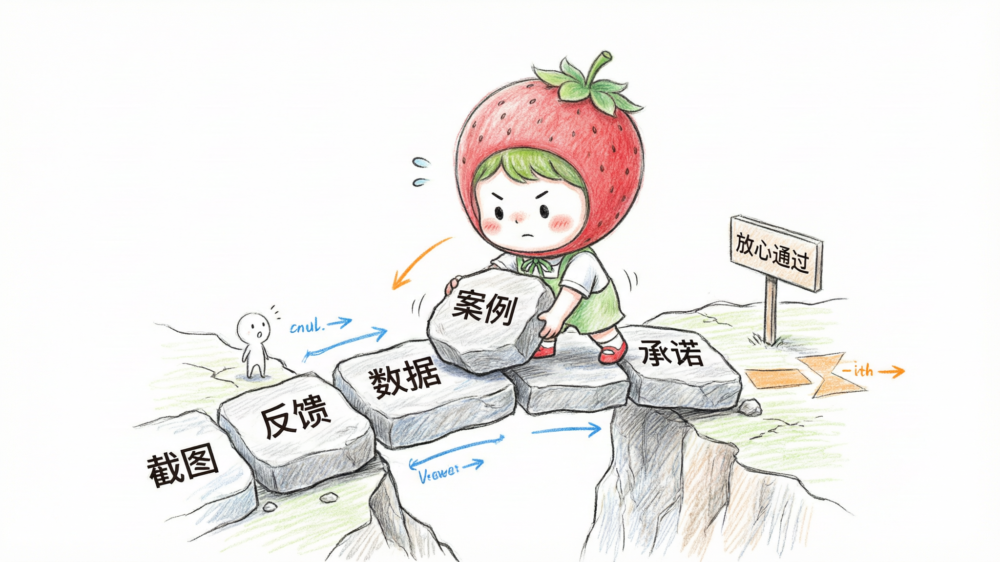
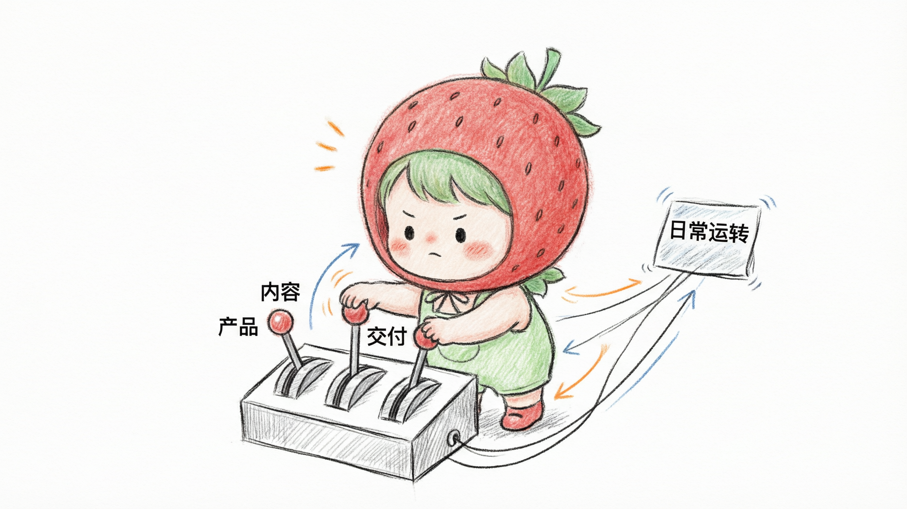
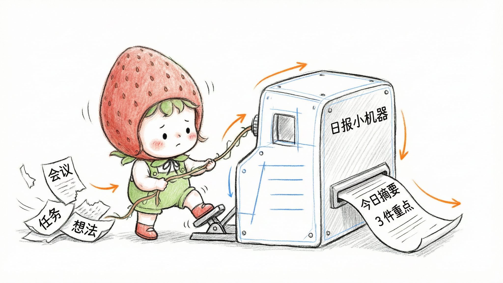

# Caomeiyaya Illustrations

> 把中文文章里的判断、流程、状态和隐喻，变成一张张有草莓芽芽参与核心动作的白底手绘正文配图。
>
> 16:9 横版 | 草莓芽芽 IP | 纯白手绘 | 少量红橙蓝中文批注 | Codex Skill

---

## 这个仓库是什么

Caomeiyaya Illustrations 是一个从 [Ian Xiaohei Illustrations](https://github.com/helloianneo/ian-xiaohei-illustrations) 二创而来的 Codex Skill，用来指导 AI Agent 为中文文章、帖子、博客、Notion 文档和方法论内容生成正文配图。

它保留了原 Skill 的核心方法：先理解文章里的认知锚点，再把其中一个判断、流程、结构、状态或隐喻，变成一张有记忆点的 16:9 手绘解释图。

这版的默认视觉 IP 是“草莓芽芽”：戴草莓帽、叶片刘海、绿色背带装、草莓小配件的软萌桌宠。草莓芽芽不是贴纸或头像，而是正在认真参与系统运转、搬运信息、解决卡点的小助手。

一句话：**让 AI 不只是“配一张图”，而是让草莓芽芽把文章里的一个关键认知动作画出来。**

---

## 二创方式

这次二创参考了“用小黑 Skill 定制自己的 IP 配图”的工作流：

1. 复刻原始仓库。
2. 让 AI 学习仓库结构，列出需要调整的清单。
3. 引入自己的 IP reference。
4. 改写 Skill 文档、角色设定、prompt 模板和 QA。
5. 用新 Skill 生成配图并继续迭代 reference。

当前仓库已经把可安装 Skill 子目录改为：

```text
caomeiyaya-illustrations/
```

---

## 适合谁用

特别适合：

- 写中文文章，需要正文配图和文章插图的人
- 做知识型内容、方法论内容、AI 工作流内容的人
- 想把抽象判断画成具体隐喻的人
- 想让自己的桌宠或个人 IP 参与内容表达的人
- 用 Codex 做内容生产，希望稳定复用一套视觉语言的人

不适合：

- 想要商业插画、品牌 KV 或精致扁平插画的人
- 想要传统 PPT 信息图、复杂架构图或流程图的人
- 只想生成可爱头像、贴纸或表情包的人
- 想把大量正文、长段解释或完整课程页塞进一张图里的人
- 需要严格可编辑矢量源文件的人

---

## 它会产出什么

默认输出：

- 16:9 横版正文配图
- 一篇文章的 4-8 张 shot list
- 每张图的主题、核心意思、结构类型、草莓芽芽动作和中文标注建议
- 最终 PNG 图片，保存到 workspace 的 `assets/<article-slug>-illustrations/`

默认不输出：

- PPTX / PDF / Keynote
- SVG / HTML / Canvas 可编辑图
- 商业海报或封面 KV
- 头像、贴纸、表情包合集
- 大段文字型信息图

---

## 视觉风格

这个 Skill 默认使用“草莓芽芽中文正文配图”风格：

- 纯白背景，不要纸纹、米色、阴影、渐变
- 黑色手绘线稿，细线，轻微抖动
- 大量留白，主体只占画面约 40%-60%
- 少量红色、橙色、蓝色中文手写批注
- 草莓红和叶绿色只用于角色识别与少量重点
- 一张图只表达一个核心动作、结构、状态或隐喻
- 草莓芽芽必须参与核心动作，不能只是装饰
- 可以软萌，但不能只有卖萌；角色必须服务结构表达

---

## 草莓芽芽 Reference

这些图片用于稳定草莓芽芽的形象识别，不是构图模板。

### 歌唱动作



### 坐姿眨眼


### 摔倒动态



桌宠素材也保存在 `assets/caomeiyaya-reference/pet.json` 和 `assets/caomeiyaya-reference/spritesheet.webp`。

---

## 草莓芽芽正文配图样片

第二阶段新增了 6 张 16:9 横版样片，用来验证草莓芽芽能否从“角色 reference”进入“正文配图主体”。当前版本已使用 `qwen-image-2.0-pro` 重新生成正式样片，覆盖信息过载、产品验证、内容复利、一人公司、信任建立和自动日报。

### 样片总览



### 信息过载



### 产品验证



### 内容复利



### 信任建立



### 一人公司



### 自动日报



样片对应的生成/重绘提示词见 [examples/caomeiyaya-showcase/prompts.md](examples/caomeiyaya-showcase/prompts.md)。安装后的 Skill 内部也保留了一份样片资产：`caomeiyaya-illustrations/assets/caomeiyaya-showcase/`。

---

## 原始结构样例

`examples/images/` 与 `caomeiyaya-illustrations/assets/examples/` 中仍保留原始小黑结构样例，用于校准线条密度、留白、颜色克制和角色参与方式。使用时应该从当前文章重新发明隐喻，不要照抄旧案例的物件和构图。

---

## 安装

克隆仓库：

```bash
git clone https://github.com/cynthialxxxx/caomeiyaya-illustrations.git
cd caomeiyaya-illustrations
```

复制 Skill 到 Codex skills 目录：

```bash
mkdir -p "${CODEX_HOME:-$HOME/.codex}/skills"
cp -R ./caomeiyaya-illustrations "${CODEX_HOME:-$HOME/.codex}/skills/"
```

安装后，在 Codex 里使用：

```text
Use $caomeiyaya-illustrations 为这篇中文文章设计并生成 5 张草莓芽芽正文配图。
```

---

## 怎么用

### 只做配图规划

```text
Use $caomeiyaya-illustrations 先不要生图。
请分析下面这篇文章哪里值得配图，输出 5 张左右的 shot list。
每张图写清楚：放在哪段后、主题、核心意思、结构类型、草莓芽芽在做什么、建议中文标注词。

<粘贴文章>
```

### 直接生成正文配图

```text
Use $caomeiyaya-illustrations 把下面这篇文章生成 4 张草莓芽芽正文配图。
要求：16:9 横版、纯白背景、黑色手绘线稿、少量红橙蓝中文手写批注。

<粘贴文章>
```

### 为单个概念生成一张图

```text
Use $caomeiyaya-illustrations 为“信任不是喊出来的，而是一块证据一块证据铺过去”生成一张正文配图。
画面要清爽、有戏，草莓芽芽必须承担核心动作。
```

### 去掉图里的标题或错误文字

```text
Use $caomeiyaya-illustrations 帮我编辑这张图，去掉左上角的“流程图”标题，其他内容保持不变。
```

更多示例见 [examples/prompts.md](examples/prompts.md)。

---

## 工作流程

这个 Skill 的流程是：

1. 读取文章、Markdown、Notion 内容、截图或用户给的主题
2. 提炼核心观点、认知转折、流程结构和适合视觉化的段落
3. 先输出 shot list：每张图只选一个认知锚点
4. 为每张图选择结构类型：Workflow、系统局部、前后对比、角色状态、概念隐喻、方法分层、地图路线或小漫画分镜
5. 重新发明一个低科技、轻盈但成立的物理隐喻
6. 让草莓芽芽承担核心动作
7. 每张图单独调用图像模型生成
8. 按 QA checklist 检查：白底、留白、草莓芽芽动作、中文标注、非 PPT 感、非旧案例复刻
9. 保存最终 PNG，并报告用途和路径

---

## 目录结构

```text
.
├── README.md
├── LICENSE
├── NOTICE.md
├── assets/
│   ├── caomeiyaya-reference/
│   └── ian-wechat-qr.jpg
├── examples/
│   ├── caomeiyaya-showcase/
│   ├── images/
│   └── prompts.md
├── scripts/
│   └── generate_qwen_showcase.py
└── caomeiyaya-illustrations/
    ├── SKILL.md
    ├── agents/
    │   └── openai.yaml
    ├── assets/
    │   ├── caomeiyaya-reference/
    │   ├── caomeiyaya-showcase/
    │   └── examples/
    └── references/
        ├── style-dna.md
        ├── caomeiyaya-ip.md
        ├── composition-patterns.md
        ├── prompt-template.md
        └── qa-checklist.md
```

真正需要安装到 Codex 的是子目录：

```text
caomeiyaya-illustrations/
```

---

## 注意事项

- 图片里的中文文字越短越稳定。
- 每张图只讲一个核心结构，不要把文章做成说明书。
- 草莓芽芽必须承担核心动作；如果去掉她画面仍然完全成立，说明她太装饰了。
- Reference 图只用于校准角色识别，不要复刻姿势或背景。
- 原始小黑示例只用于校准结构密度，不要复刻构图。
- AI 图像模型可能出现错字、幻觉标签、风格漂移或多余标题，生成后需要检查。
- 如果中文错字严重，优先减少标注词并重生成。

---

## 来源与署名

本仓库 fork 自 [helloianneo/ian-xiaohei-illustrations](https://github.com/helloianneo/ian-xiaohei-illustrations)，保留原项目的 MIT License 与 NOTICE。原始小黑方法论、结构样例和部分示例图片来自 Ian Xiaohei Illustrations；草莓芽芽角色设定与 reference 素材为本仓库二创内容。

---

## License

MIT License. See [LICENSE](LICENSE).
